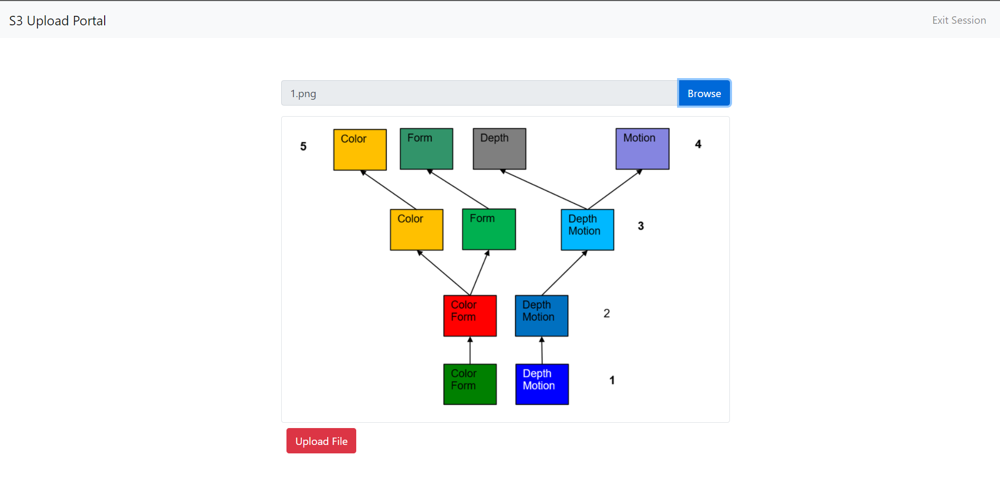
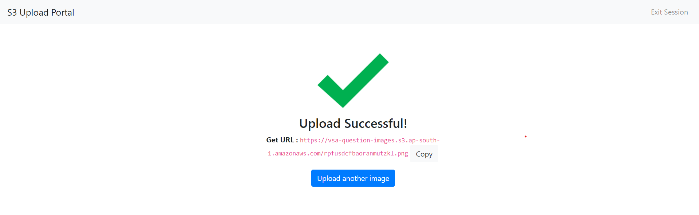

# S3 Image Upload Portal




## Contents
  - [Introduction](#introduction)
  - [Setup](#setup)
  - [Usage](#usage)
  - [Contributing](#contributing)
  - [License](#license)
  - [Author](#author)

## Introduction
This project is a monolithic Flask web-portal and micro-service which can be used to quickly setup a password-protected image upload portal for any S3 compatible storage service. I built this project as an intuitive upload portal for crowd-aggregated image uploads to an S3 instance.

## Setup
1. Set up repository and environment.
```bash
# clone this repository
git clone git@github.com:kaushalvivek/s3-upload-portal.git

# setup and use local python environment
cd s3-upload-portal
pip3 -m venv env
source env/bin/activate
```
2. Install required packages
```bash
# install required packages
pip3 install -r requirements.txt
```
3. Create a config file `settings.conf` in the project root with the following fields:
```conf
[keys]
; secret key is the application secret key
secret_key = 
; password is the authentication for the upload portal
password = 

[aws]
; AWS/S3 compatible credentials need to be generated
access_key_id = 
secret_key = 
bucket_name = 
region = 

[files]
; feature unavailable in v1.0.0
log_file = 

[settings]
; session type is the flask session type -- typically `filesystem`
session_type = 
```
4. Start the server
```bash
python3 app.py
```

## Usage
Once the application is setup, go the the `hostname:port` URL, provide the authentication password and start uploading your image file to S3 easily. 



## Contributing
Create issues for suggestions, bugs, feature requests and feel free to extend the project.

## License
MIT License.

## Author
[@kaushalvivek](https://vivekkaushal.com)
